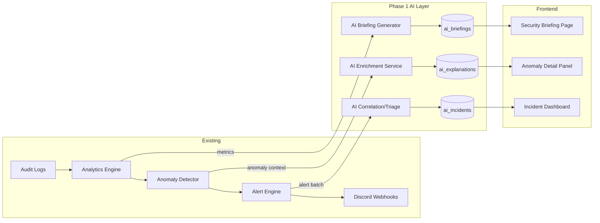

# AI Integration Proposal for SpecterDefence

> A practical, two-phase plan to add AI-powered capabilities to SpecterDefence's Microsoft 365 security monitoring platform.

---

## Executive Summary

SpecterDefence already has a strong foundation of **rule-based detection** (anomaly detection, threat intelligence, alert rules with deduplication) and **data collection** (audit logs, login analytics, DLP events, mailbox rules, OAuth apps, CA policies, MFA status, SharePoint sharing). This proposal describes how to layer AI on top of these existing systems to:

- **Phase 1 — Smarter Monitoring & Alerting**: Reduce noise, surface hidden patterns, and give security teams faster context.
- **Phase 2 — Assisted Remediation**: Let analysts act on AI-generated recommendations with one-click execution (human-in-the-loop, not auto-remediation).

---

## Current State of the Platform

| Capability | Implementation |
|---|---|
| Login anomaly detection | `AnomalyDetector` — impossible travel, new country/IP, failed logins, malicious IP |
| Threat intelligence | AbuseIPDB + AlienVault OTX combined client |
| Alert engine | Rule matching, severity filtering, deduplication, Discord webhooks |
| DLP monitoring | Audit log processing for DLP rule matches |
| Mailbox security | Inbox rule forwarding, non-owner access detection |
| CA Policies | Conditional Access policy analysis |
| MFA reporting | Per-user MFA method and status tracking |
| OAuth apps | Third-party app permission analysis |
| SharePoint | Sharing link analytics |
| Monitoring | Domain, SSL, and website uptime checks |

> [!NOTE]
> The config already includes a `KIMI_API_KEY` field, indicating some AI integration was planned. This proposal is provider-agnostic but recommends starting with **OpenAI GPT-4o-mini** or **Google Gemini Flash** for cost-effective, low-latency inference in Phase 1, with the option to swap models.

---

## Phase 1 — AI-Enhanced Monitoring & Alerting

Phase 1 focuses on **read-only AI capabilities** — no changes are made to M365 tenants. The AI observes, correlates, and explains.

### 1.1 Alert Triage & Noise Reduction

**Problem**: Rule-based alerts fire on individual signals. Security teams can be overwhelmed by low-value alerts (e.g., "new IP" for a traveling executive).

**AI Solution**: An **Alert Correlation Service** that:

- Groups related alerts (same user, same time window, same tenant) into **incidents**
- Assigns a composite AI risk score by considering all signals together
- Adds a natural-language **triage summary** explaining *why* these events are suspicious
- Learns from dismissed/acknowledged alerts to down-weight recurring false positives over time

**Implementation Sketch**:
```
src/
  ai/
    __init__.py
    client.py            # LLM client abstraction (OpenAI, Gemini, Kimi)
    prompts/
      triage.py          # System + user prompts for alert triage
      summarize.py       # Prompts for incident summarization
    correlation.py       # Groups raw alerts → incidents
    triage_service.py    # Calls LLM to score & summarize incidents
```

**How it works**:
1. When `AlertEngine.process_event()` fires, correlated events within a sliding window (e.g., 15 min) for the same user are batched.
2. Batch context (all anomaly flags, CTI results, user history, CA policy state) is serialized into a structured prompt.
3. LLM returns: `{ "risk_level": "high", "confidence": 0.87, "summary": "...", "recommended_actions": [...] }`
4. The triage result is stored alongside the alert history and surfaced in the frontend.

**Frontend**: A new **"AI Insights"** panel on the Dashboard and in the alert detail view, showing:
- AI summary of the incident
- Composite risk score with confidence indicator
- Contributing factors (clickable links to each underlying alert)

---

### 1.2 Security Posture Natural Language Summaries

**Problem**: The dashboard shows metrics and charts, but interpreting 15 different numbers across 5 tenants requires expertise.

**AI Solution**: Generate **periodic natural-language security briefings** per tenant and across all tenants:

- Daily/weekly executive-level summary (e.g., *"Tenant Contoso had 3 high-risk login anomalies this week, up from 0 last week. Two users lack MFA enrollment. Three OAuth apps have excessive permissions."* )
- Trend detection — call out when metrics are moving in a concerning direction
- Highlight what changed (new CA policy gaps, new risky OAuth apps, etc.)

**Implementation**:
- A scheduled task (e.g., runs daily via the existing background task infrastructure) gathers key metrics from the dashboard service, MFA report, OAuth apps, and CA policies.
- Metrics are serialized and sent to the LLM with a "security analyst briefing" system prompt.
- Output stored in a new `ai_briefings` table and displayed on a **"Security Briefing"** page.

---

### 1.3 Anomaly Explanation & Context Enrichment

**Problem**: The current anomaly detector flags events (e.g., "impossible travel") but doesn't explain their significance in the context of the user's broader profile.

**AI Solution**: Enrich each anomaly with an AI-generated **contextual explanation**:

- *"This user typically logs in from New York (95% of logins in the past 30 days). A login from Lagos, Nigeria in a 20-minute window is highly unusual. The source IP 102.x.x.x has a moderate threat score (45) on AbuseIPDB. Combined with 2 failed login attempts in the past hour, this is likely a credential compromise."*

**Implementation**:
- Triggered when `AnomalyDetector.analyze_login()` returns anomalies with `risk_score > 30`.
- User history, CTI data, and anomaly details are packaged into a prompt.
- Response stored in the `LoginAnalyticsModel` as an `ai_explanation` field.

---

### 1.4 Intelligent Alert Rules (AI-Suggested Rules)

**Problem**: Admins must manually configure alert rules and may miss important event type combinations.

**AI Solution**: The system analyzes historical alert data and suggests new rules:

- *"In the past 30 days, 8 'new_country' events followed by 'multiple_failures' within 1 hour were all confirmed incidents. Consider creating a compound rule."*
- Suggestions appear in the Settings/Alerts page as dismissible recommendations.

---

### Phase 1 Architecture Summary



---

## Phase 2 — Assisted Remediation (Human-in-the-Loop)

Phase 2 introduces **write capabilities** — but only when explicitly triggered by a security analyst. The AI generates remediation actions; the human reviews and approves.

### 2.1 Remediation Playbook Engine

**Concept**: For each detected incident type, the AI generates a **remediation playbook** — a step-by-step list of actions the analyst can execute directly from the SpecterDefence UI.

| Incident Type | Example Remediation Actions |
|---|---|
| Credential compromise (impossible travel + malicious IP) | 1. Revoke user sessions  2. Reset password  3. Enforce MFA re-registration  4. Block source IP in CA policy |
| Suspicious OAuth app | 1. Revoke app consent  2. Disable app  3. Notify affected users |
| Risky mailbox rule (external forward) | 1. Disable the inbox rule  2. Audit recent forwarded emails  3. Alert the user's manager |
| MFA gap | 1. Send MFA enrollment reminder  2. Set CA policy to require MFA within 7 days |
| Excessive SharePoint sharing | 1. Expire anonymous sharing links  2. Convert to org-only links |

**How it works**:
1. When an AI-triaged incident is opened, the AI generates a playbook based on the incident context.
2. Each playbook step maps to a **concrete Graph API call** that SpecterDefence already knows how to make (or will be extended to make).
3. The analyst reviews the playbook in the UI, can modify it, and clicks **"Execute Step"** on each action individually.
4. SpecterDefence executes the Graph API call and logs the result in an audit trail.
5. No action runs without explicit human approval.

**Implementation Sketch**:
```
src/
  ai/
    prompts/
      remediation.py     # Prompts for generating playbooks
    playbook.py          # Playbook density model & generation
    remediation.py       # Maps playbook steps → Graph API calls
  models/
    playbook.py          # PlaybookModel, PlaybookStepModel, ExecutionLogModel
  api/
    playbooks.py         # CRUD + execute endpoints
```

---

## Technical Decisions

### LLM Provider Strategy

| Concern | Recommendation |
|---|---|
| **Primary model** | OpenAI `gpt-4o-mini` or Google `gemini-1.5-flash` — best balance of cost, speed, and quality for security analysis. |
| **BYOAI Strategy** | **"Bring Your Own AI"** — allow users to provide their own API keys (OpenAI, Gemini, Azure OpenAI) or custom endpoints (Ollama/self-hosted) to fulfill the requests. |
| **Architecture** | Provider-agnostic abstraction via `src/ai/client.py`. Start with a "standard" cheap default for out-of-the-box value. |
| **API key management** | New `AI_PROVIDER` and `AI_API_KEY` settings in `config.py`. Enforce environment-level secrets. |
| **Rate limiting** | Token budget and rate-limiting per tenant to control shared costs. |
| **Caching** | Aggressive caching of non-user-specific analysis to minimize duplicate LLM calls. |

### Data Privacy & Security

> [!IMPORTANT]
> Security telemetry data sent to LLM APIs must be handled carefully.

- **No PII in prompts by default**: User emails are pseudonymized before sending to the LLM (e.g., `user_a@tenant_1`). The mapping is kept server-side.
- **Opt-in**: AI features are disabled by default per tenant. Admins explicitly enable them.
- **Data retention**: AI-generated content (summaries, playbooks) is stored in the SpecterDefence database, not in the LLM provider's systems.
- **Self-hosted option**: The `client.py` abstraction supports local models via Ollama or vLLM for organizations that cannot send data externally.

### Cost Estimates (Phase 1)

| Feature | Estimated tokens/day (10 tenants, ~500 users) | Cost/month (GPT-4o-mini) |
|---|---|---|
| Alert triage & correlation | ~50K tokens | ~$2 |
| Anomaly explanations | ~30K tokens | ~$1 |
| Daily security briefings | ~20K tokens | ~$0.75 |
| **Total Phase 1** | **~100K tokens/day** | **~$4-5/month** |

> [!TIP]
> At GPT-4o-mini pricing ($0.15/1M input, $0.60/1M output), Phase 1 AI features would cost roughly the price of a coffee per month for a typical deployment.

---

## Implementation Roadmap

### Phase 1 (Estimated: 3-4 weeks)

| Week | Deliverable |
|---|---|
| 1 | `src/ai/` module — LLM client abstraction, prompt templates, unit tests |
| 2 | Alert correlation service, AI triage integration, `ai_incidents` model |
| 3 | Anomaly enrichment, security briefing generator, `ai_briefings` model |
| 4 | Frontend — AI Insights panel, Incident Dashboard, Security Briefing page |

### Phase 2 (Estimated: 4-6 weeks)

| Week | Deliverable |
|---|---|
| 1-2 | Playbook data model, playbook generation prompts, Graph API remediation mappings |
| 3 | Remediation queue UI, approval workflow, execution logging |
| 4-5 | Chat-based security assistant with function calling |
| 6 | End-to-end testing, documentation, security review |

---

## What This Proposal Does NOT Include

- ❌ **Autonomous auto-remediation** — all actions require human approval
- ❌ **Training custom ML models** — we use pre-trained LLMs via API, no model training infrastructure
- ❌ **Replacing existing rule-based detection** — AI augments the current system, it doesn't replace it
- ❌ **User-facing AI in the login flow** — AI is only used in the admin/analyst interface

---

## Current Status (v1.1.0)

**Infrastructure Ready:**
- `KIMI_API_KEY` configuration added to `src/config.py` (Moonshot AI / Kimi integration ready).
- Alert pipeline supports metadata enrichment.
- Frontend "AI Analyst" UI components in development.

**Implementation Priority:**
1. ✅ Alert Metadata (Implemented)
2. 🔄 LLM Webhook (In Progress)
3. ⏳ AI Response Suggestions (Planned)

Want me to create a proper feature specification for any of these? Or should we start implementing the AI Security Analyst (Alert Enrichment) feature? 🚀
