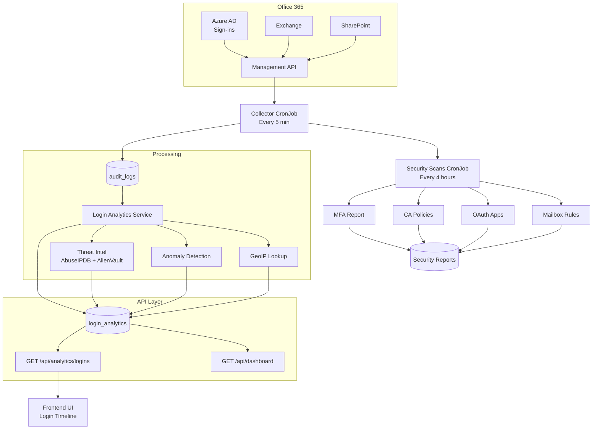

# CronJob Processing Flows - Mermaid Diagrams

## Overview

There are two main CronJobs in SpecterDefence:

1. **Collector CronJob** - Runs every 5 minutes
2. **Security Scans CronJob** - Runs every 4 hours

---

## Collector CronJob Flow (Every 5 Minutes)

```mermaid
flowchart TD
    A[Start: Collector CronJob<br/>python -m src.collector.main] --> B[Initialize Database]
    B --> C[Get Active Tenants]
    C --> D{For each tenant}

    subgraph Tenant_Collection["For Each Tenant"]
        D --> E[Create O365ManagementClient]
        E --> F[Fetch from O365 Management API]

        subgraph Content_Types["Fetch Content Types"]
            F --> G1[Audit.AzureActiveDirectory<br/>Sign-ins]
            F --> G2[Audit.Exchange]
            F --> G3[Audit.SharePoint]
            F --> G4[Audit.General]
            F --> G5[DLP.All]
        end

        G1 --> H[Store events in audit_logs table]
        G2 --> H
        G3 --> H
        G4 --> H
        G5 --> H

        H --> I[Process Signin Logs<br/>LoginAnalyticsService.process_audit_log_signins]

        subgraph Signin_Processing["Signin Processing (per log)"]
            I --> I1[Get unprocessed signin logs]
            I1 --> I2{For each signin log}

            I2 --> I3[Parse raw audit data]
            I3 --> I4[Extract: UserPrincipalName, ClientIP, Operation, ErrorNumber, LogonError]

            I4 --> I5{Determine is_success}

            subgraph Success_Detection["Success/Failure Detection (PR #20)"]
                I5 --> S1{Operation contains<br/>'UserLoginFailed'?}
                S1 -->|Yes| S2[is_success = False<br/>failure_reason = LogonError]
                S1 -->|No| S3{Check ErrorNumber}

                S3 --> S4{ErrorNumber in<br/>failure_error_codes?}
                S4 -->|Yes| S5[is_success = False<br/>failure_reason = LogonError<br/>or Error: code]
                S4 -->|No| S6{ErrorNumber = 50140?}

                S6 -->|Yes| S7[is_success = True<br/>Strong auth required<br/>NOT a failure]
                S6 -->|No| S8{Check LogonError}

                S7 --> S8
                S5 --> S8
                S2 --> S8

                S8 --> S9{LogonError present?}
                S9 -->|Yes| S10[is_success = False<br/>failure_reason = LogonError]
                S9 -->|No| S11{Check ExtendedProperties}

                S10 --> S11
                S11 --> S12{ResultStatusDetail<br/>!= 'Success'?}

                S12 -->|Yes| S13[failure_reason = ResultStatusDetail]
                S12 -->|No| S14[failure_reason = null]

                S13 --> S15[Continue]
                S14 --> S15[Continue]
            end

            I5 --> J[Look up IP in Threat Intel]

            subgraph Threat_Intel["Threat Intel Lookup"]
                J --> T1[Check AbuseIPDB API]
                J --> T2[Check AlienVault OTX API]
                T1 --> T3[Combine results]
                T2 --> T3
                T3 --> T4{is_malicious?]
                T4 -->|Yes| T5[Set threat_score, threat_tags<br/>threat_sources]
                T4 -->|No| T6[threat_score = 0<br/>threat_tags = []]
            end

            J --> K[Run Anomaly Detection]

            subgraph Anomaly_Detection["Anomaly Detection"]
                K --> A1[Check new device]
                K --> A2[Check new location]
                K --> A3[Check impossible travel]
                K --> A4[Check time-of-day]
                K --> A5[Check failed attempts]

                A1 --> A6{Detected?}
                A2 --> A6
                A3 --> A6
                A4 --> A6
                A5 --> A6

                A6 -->|Yes| A7[Add to anomaly_flags<br/>Calculate risk_score]
                A6 -->|No| A8[Continue]
            end

            K --> L[Check Unapproved Country]

            subgraph Unapproved_Country["Unapproved Country Check"]
                L --> UC1{Login successful?<br/>& geo.country_code exists?}
                UC1 -->|Yes| UC2{Geo country NOT in<br/>tenant approved_countries?}
                UC1 -->|No| UC6[Skip]
                UC2 -->|Yes| UC3[Add 'unapproved_country'<br/>risk_score += 80]
                UC2 -->|No| UC4[Continue]
                UC3 --> UC5[Log warning]
                UC4 --> UC5[Continue]
                UC5 --> M
                UC6 --> M
            end

            A7 --> M
            A8 --> M
            T5 --> M
            T6 --> M
            S13 --> M
            S14 --> M

            M[Create login_analytics record<br/>with all fields]
            M --> N[Insert into login_analytics table]
            N --> O[Mark audit_log as processed]
            O --> I2
        end

        I --> P[Process General Logs<br/>LoginAnalyticsService.process_audit_log_general]
        P --> Q[Mark general audit_logs<br/>as processed]
    end

    Q --> D
    D --> R[End: Return results]
    R --> S[Log summary:<br/>Tenants processed, events collected]

    style S1 fill:#ffcccc
    style S4 fill:#ffcccc
    style S5 fill:#ffcccc
    style S9 fill:#ffcccc
    style S10 fill:#ffcccc
    style T5 fill:#ffcccc
    style A7 fill:#ffcccc
    style UC3 fill:#ffcccc
    style S7 fill:#ccffcc
```

---

## Security Scans CronJob Flow (Every 4 Hours)

```mermaid
flowchart TD
    A[Start: Security Scans CronJob<br/>python -m src.collector.security_scans] --> B[Initialize Database]
    B --> C[Get Active Tenants]
    C --> D{For each tenant}

    subgraph Tenant_Security_Scans["For Each Tenant"]
        D --> E[MFA Report Service]

        subgraph MFA_Scan["MFA Report Scan"]
            E --> M1[Fetch users from Entra ID]
            M1 --> M2[Check each user's MFA methods]
            M2 --> M3[Check: Phone auth, Authenticator, FIDO2, etc.]
            M3 --> M4{ MFA enabled?}
            M4 -->|No| M5[Mark as 'no_mfa'<br/>Add to report]
            M4 -->|Yes| M6[Mark as 'mfa_enabled']
            M5 --> M6
            M6 --> M7[Store in tenant_mfa_enforcement table]
        end

        E --> F[CA Policies Service]

        subgraph CA_Scan["CA Policies Scan"]
            F --> C1[Fetch CA policies from Entra ID]
            C1 --> C2[Check: Require MFA, Compliant device, etc.]
            C2 --> C3[Store in tenant_ca_policies table]
        end

        E --> G[OAuth Apps Service]

        subgraph OAuth_Scan["OAuth Apps Scan"]
            G --> O1[Fetch OAuth apps from Entra ID]
            O1 --> O2[Check permissions, consent status]
            O2 --> O3{Dangerous permissions?<br/>e.g., Mail.Read, Files.Read]}
            O3 -->|Yes| O4[Mark as high_risk<br/>Add to report]
            O3 -->|No| O5[Mark as normal]
            O4 --> O6[Store in tenant_oauth_apps table]
            O5 --> O6
        end

        E --> H[Mailbox Rules Service]

        subgraph Mailbox_Scan["Mailbox Rules Scan"]
            H --> R1[Fetch inbox rules from user mailboxes]
            R1 --> R2[Check each rule action]
            R2 --> R3{Forward to external?<br/>or Auto-forward?}
            R3 -->|Yes| R4[Mark as suspicious<br/>Add to report]
            R3 -->|No| R5[Check: Delete, Move, etc.]
            R5 --> R6{Suspicious action?}
            R6 -->|Yes| R7[Mark as suspicious]
            R6 -->|No| R8[Mark as normal]
            R4 --> R9[Store in mailbox_rules table]
            R7 --> R9
            R8 --> R9
        end
    end

    M7 --> C3
    C3 --> O6
    O6 --> R9
    R9 --> D

    D --> I[End: Return results]
    I --> J[Log summary:<br/>Scans completed per tenant]
```

---

## Complete Data Flow Summary



---

## Key Processing Logic Details

### Failure Error Codes (PR #20)
The following ErrorNumbers indicate actual login failures:
- **50053**: Account locked
- **50074**: Password expired
- **50126**: Invalid credentials
- **50127**: User does not exist
- **50140**: **SKIP** - Strong auth required (not a failure!)
- **And 11 more codes...**

### Anomaly Types Detected
- `new_device` - Login from unknown device
- `new_location` - Login from new country/city
- `impossible_travel` - Login from distant location in short time
- `time_of_day` - Login at unusual hour
- `failed_attempts` - Multiple failed attempts
- `unapproved_country` - Login from non-approved country

### Security Scan Services
1. **MFA Report** - Checks which users have MFA enabled
2. **CA Policies** - Reviews Conditional Access policies
3. **OAuth Apps** - Audits third-party app permissions
4. **Mailbox Rules** - Detects suspicious inbox rules (forwarding)