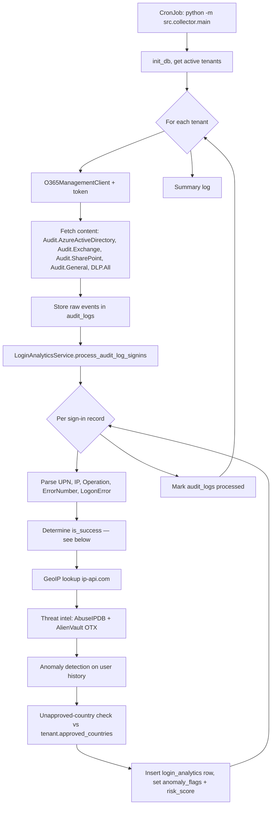
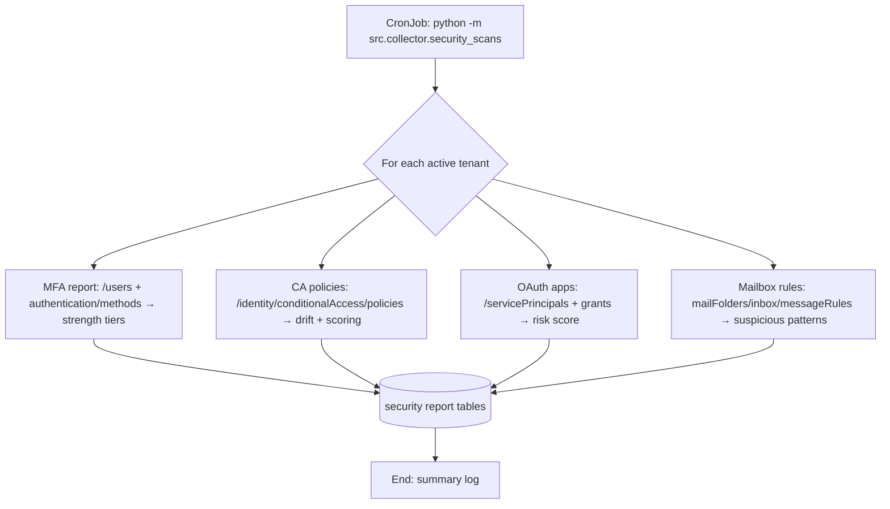

# Collector & Scan Processing Flows

Two scheduled jobs (CronJobs in `k8s/prod/`) plus an hourly monitoring job:

- **Collector** `src.collector.main` — every 5 minutes: pulls the O365 Management Activity API feed and processes sign-ins.
- **Security scans** `src.collector.security_scans` — every 4 hours: MFA report, CA policies, OAuth apps, mailbox rules.
- **Monitoring** `src.collector.monitoring` — hourly: website availability, SSL expiry, domain registration.

## Collector flow

```mermaid
flowchart TD
    A[CronJob: python -m src.collector.main] --> B[init_db, get active tenants]
    B --> C{For each tenant}
    C --> D[O365ManagementClient + token]
    D --> E[Fetch content: Audit.AzureActiveDirectory, Audit.Exchange, Audit.SharePoint, Audit.General, DLP.All]
    E --> F[Store raw events in audit_logs]
    F --> G[LoginAnalyticsService.process_audit_log_signins]
    G --> H{Per sign-in record}
    H --> I[Parse UPN, IP, Operation, ErrorNumber, LogonError]
    I --> J[Determine is_success — see below]
    J --> K[GeoIP lookup ip-api.com]
    K --> L[Threat intel: AbuseIPDB + AlienVault OTX]
    L --> M[Anomaly detection on user history]
    M --> N[Unapproved-country check vs tenant.approved_countries]
    N --> O[Insert login_analytics row, set anomaly_flags + risk_score]
    O --> H
    H --> P[Mark audit_logs processed]
    P --> C
    C --> Q[Summary log]
```

### Success/failure determination

`ResultStatus: Success` from the Management API means the request was processed — not that the login succeeded. `is_success` is decided by: `Operation` containing `UserLoginFailed` → failure; `ErrorNumber` in `FAILURE_ERROR_CODES` (50053, 50074, 50076, 50126, 50127, 50133, 50134, 50135, 50136, 50144, 50146–50152) → failure; ErrorNumber **50140** (strong-auth interrupt) → explicitly **not** a failure; otherwise `LogonError`, `ExtendedProperties/ResultStatusDetail`, and `Status.ErrorCode` are used as fallbacks.

### Anomaly types

From `src/analytics/anomalies.py` (`AnomalyType`) + the tenant-country check in `logins.py`:

`impossible_travel` (max 900 km/h), `new_country`, `new_ip`, `failed_login`, `multiple_failures`, `suspicious_location`, `malicious_ip`, `unapproved_country`.

## Security scan flow

```mermaid
flowchart TD
    A[CronJob: python -m src.collector.security_scans] --> B{For each active tenant}
    B --> M[MFA report: /users + authentication/methods → strength tiers]
    B --> C[CA policies: /identity/conditionalAccess/policies → drift + scoring]
    B --> O[OAuth apps: /servicePrincipals + grants → risk score]
    B --> R[Mailbox rules: mailFolders/inbox/messageRules → suspicious patterns]
    M --> S[(security report tables)]
    C --> S
    O --> S
    R --> S
    S --> D[End: summary log]
```

## Alerting flow

Two trigger paths into `AlertEngine.process_event`:

1. **Security scans** — CA policy, OAuth app, and mailbox-rule services raise alerts directly at the end of their scans.
2. **Login anomalies** — `AlertProcessor` (background loop, 60 s) polls new `login_analytics` rows and maps anomaly flags to `EventType`s: `impossible_travel→IMPOSSIBLE_TRAVEL`, `new_country→NEW_COUNTRY`, `new_ip→NEW_IP`, `multiple_failures→MULTIPLE_FAILURES`, `failed_login→BRUTE_FORCE`, `suspicious_location→SUSPICIOUS_LOCATION`, `malicious_ip→MALICIOUS_IP`. (The `unapproved_country` flag is stored in analytics but currently has no `EventType` mapping, so it does not produce an alert.)

```mermaid
flowchart TD
    A[process_event] --> B[Dedup: SHA-256 of type+user+tenant(+location/IP)]
    B --> C{Same rule fired within cooldown_minutes?}
    C -->|Yes| D[Suppressed]
    C -->|No| E[Insert alert_history row]
    E --> F[Send configured webhooks: Discord / custom]
    E --> G[WebSocket fan-out to connected dashboard clients]
```

Severity derives from risk score: ≥80 CRITICAL, ≥60 HIGH, ≥30 MEDIUM, else LOW. New alerts also appear in the dashboard via `/api/v1/ws/alerts`.

## Key tables

Raw events → `audit_logs` (+ `collection_state`, `content_subscriptions`); processed sign-ins → `login_analytics` (+ `user_login_history` baselines); scan results → `mfa_users`/`mfa_enrollment_history`/`mfa_compliance_alerts`, `ca_policies`/`ca_policy_changes`/`ca_policy_alerts`, `oauth_apps`/`oauth_app_*`, `mailbox_rules`/`mailbox_rule_*`; alerts → `alert_rules`, `alert_history`; devices → `endpoint_devices`, `endpoint_events`.
